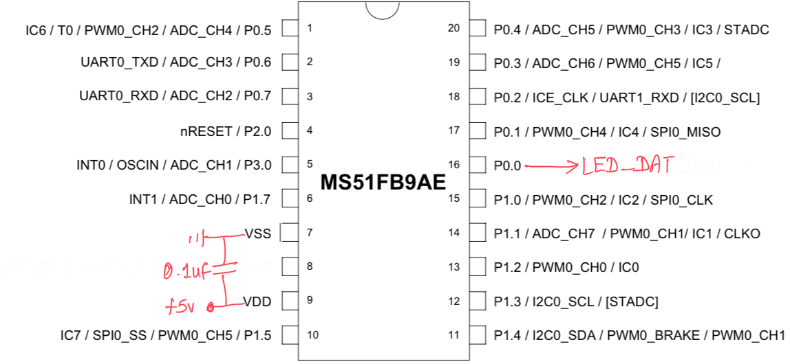
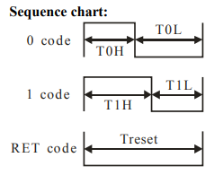
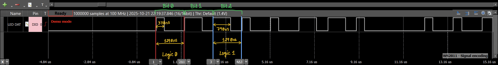
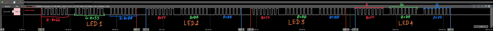

# A simple traffic light controller using 8051

This is a very simple traffic light controller, there are 2 implementation style

1. simple state machine based, enabled via the macro definition `TRAFFIC_LOGIC_STATE_MACHINE` in [logic_master.h](src/logic_master.h#L21)
2. non-state machine base, comment out the macro `TRAFFIC_LOGIC_STATE_MACHINE` in [logic_master.h](src/logic_master.h#L21)

## The Hardware
1. Nuvoton MS51FB9AE x1 nos
2. WS2811 smart LED x4 nos

*Operating voltage: 5V*

### Schematic

## Design

We use smart RGB single LED for each road to show the signal status to the user.
These smart LEDs uses 3 color channel Red,Green & Blue; 8bit for each color channel so 24bit in total
they are packed in the following format R7..R0, G7..G0, B7..B0

The color code can be found here [driver.c](src/logic_master.c#L29), which implements the following table

|Signal status|Color|Color code|Const name|
|-|-|-|-|
|STOP|Red|`{0xFF, 0, 0}`|TRAFFIC_STOP_LED_COLOR|
|WAIT|Orange|`{0x66, 0x33, 0}`|TRAFFIC_WAIT_LED_COLOR|
|GO|Green|`{0, 0xFF, 0}`|TRAFFIC_GO_LED_COLOR|

`void drvLed1Byte(uint8_t val)` function generates the low level smart LED communication signal @ 800KHz
we use simple bit-bang written in 8051 assembly language. you can find the LED signal logic High and Low encoding scheme [here](https://akizukidenshi.com/goodsaffix/WS2811.pdf)

### Logic High/Low timing

### LED signal packing

### Code customization

- Lane change wait time macro [`TRAFFIC_LANE_CHANGE_TIMEOUT`](src/logic_master.h#L26) defined in seconds, default value 1 minute (60 seconds)
- Signal change wait time macro [`TRAFFIC_SIGNAL_CHANGE_TIMEOUT`](src/logic_master.h#L25) defined in seconds, default value 10 seconds
  transition time between WAIT-to-STOP or WAIT-to-GO
- Number of roads/lanes [`TRAFFIC_LIGHT_MAX_LANES`](src/logic_master.h#L23), default value 4
- [LED color mapping](src/logic_master.c#L29)
- [state machine based/non-state machine](src/logic_master.h#L21)
